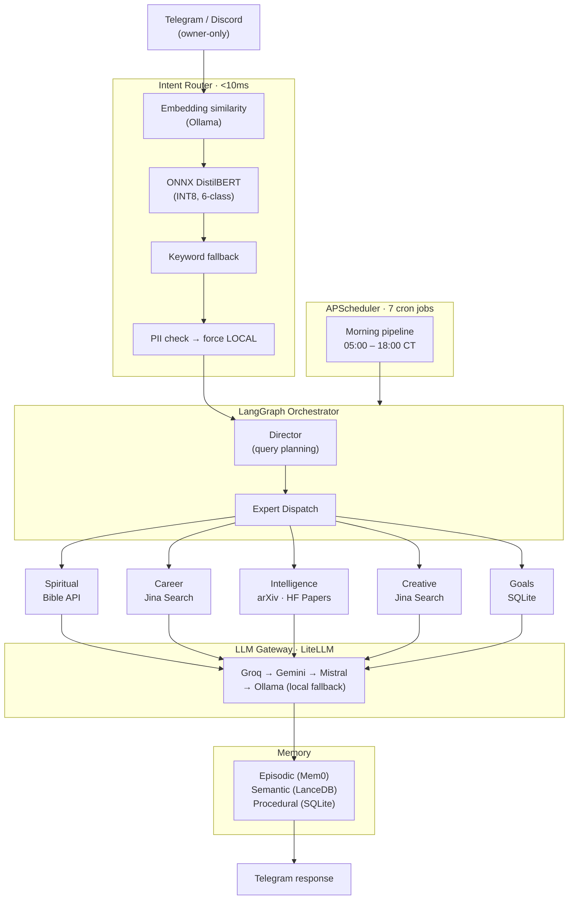

<div align="center">

<br/>

# Sovereign Edge

**A privacy-first personal AI system — five expert agents, live data grounding, edge-deployed on a Jetson Orin.**

<br/>

[](https://github.com/omnipotence-eth/sovereign-edge/actions/workflows/ci.yml)
[](https://python.org)
[](https://github.com/astral-sh/ruff)
[](https://github.com/langchain-ai/langgraph)
[](https://github.com/BerriAI/litellm)
[](LICENSE)

<br/>

[Architecture](docs/architecture.md) &nbsp;·&nbsp; [Experts](docs/experts.md) &nbsp;·&nbsp; [Setup](docs/deployment.md) &nbsp;·&nbsp; [Configuration](docs/configuration.md) &nbsp;·&nbsp; [Development](docs/development.md) &nbsp;·&nbsp; [Contributing](CONTRIBUTING.md)

<br/>

</div>

---

## Demo

<!-- Replace with a screen recording of the bot in action (OBS → GIF via Kdenlive or ScreenToGif) -->
<!-- Recommended: record a Telegram conversation showing a morning brief + live career query + scripture response -->
<!-- Target size: 800×500px, <5MB, looping GIF or MP4 -->

> *Demo coming soon — see [Verifying the Deployment](docs/deployment.md#verifying-the-deployment) for what to expect.*

---

## What is Sovereign Edge?

Sovereign Edge is an always-on personal intelligence system that runs five specialized AI agents on a **Jetson Orin Nano** (or any Linux ARM64/x86 host). It wires live data sources — arXiv, HuggingFace papers, Jina web search, Bible API — into a LangGraph multi-agent pipeline, then routes generation through a free-tier cloud LLM gateway with automatic failover.

Every message is classified in **<10ms** by an ONNX-quantized DistilBERT router before a single token is generated. PII is detected and forced to local inference. Cloud API keys are free-tier only. A scheduled morning pipeline delivers actionable briefs before your workday starts.

> **This is a single-user, single-owner system.** Access is gated to one Telegram chat ID. All design decisions optimize for privacy, low cost, and perpetual operation on constrained hardware.

---

## Why

Cloud AI services see everything you ask them. Sovereign Edge keeps your conversations, decisions, and personal data entirely on your own hardware — a Jetson Orin Nano running 5 specialized LangGraph agents. No data leaves your network. Multi-provider LLM routing (4 cloud providers + local Ollama) means you get the best model for each task without vendor lock-in. Built with production infrastructure: SOPS+Age encryption, systemd services, ONNX intent routing under 10ms, structured observability.

---

## Expert Agents

| Expert | Domain | Live Data Source | Morning Brief |
|--------|---------|-----------------|---------------|
| **Spiritual** | Scripture study, prayer, devotionals | bible-api.com (KJV) | 05:15 — daily devotional |
| **Career** | Job search, resume coaching, market intel | Jina web search | 06:00 + 18:00 rescan |
| **Intelligence** | AI/ML research synthesis, trend monitoring | arXiv, HuggingFace Daily Papers | 05:30 — digest |
| **Creative** | Writing, content strategy, social media | Jina web search | 07:00 — content prompt |
| **Goals** | Personal goal tracking, daily check-ins | SQLite goal store | 07:30 — top 3 + action |

Each expert runs a **LangGraph subgraph** — a multi-node pipeline with live data retrieval, LLM synthesis, and structured output validation via `instructor` + Pydantic. If LangGraph is unavailable, each falls back to a direct `LLMGateway.complete()` call gracefully.

---

## Architecture



### Request lifecycle in brief

1. **Message in** — auth check (owner chat ID only), rate limit (2s gap), 2000-char cap
2. **Route** — ONNX DistilBERT classifies intent in <10ms; PII forces local routing
3. **Plan** — Director LLM decides which experts to invoke and in what order
4. **Execute** — Each expert runs its LangGraph subgraph (live data fetch → LLM synthesis)
5. **Memory** — Result persisted to Mem0 episodic store + SQLite skill library
6. **Respond** — Formatted reply streamed back to Telegram

See [Architecture](docs/architecture.md) for the full request lifecycle, HITL flow, memory tiers, and design decisions.

---

## Morning Pipeline

Delivered automatically each day at the configured wake time (`SE_MORNING_WAKE_HOUR`, default `05:00` in `SE_TIMEZONE`):

| Time | Brief | Expert |
|------|-------|--------|
| 05:00 | Health check — all experts validated | System |
| 05:15 | Daily devotional with live scripture | Spiritual |
| 05:30 | AI/ML digest — arXiv + HuggingFace papers | Intelligence |
| 06:00 | Job market scan — live DFW listings | Career |
| 07:00 | Daily creative content prompt | Creative |
| 07:30 | Top 3 urgent goals + one concrete action | Goals |
| 18:00 | Evening career rescan | Career |

---

## Tech Stack

<details>
<summary><strong>View full stack</strong></summary>

<br/>

| Layer | Technology | Notes |
|-------|-----------|-------|
| **Runtime** | Python 3.11+, asyncio | Fully async I/O throughout |
| **Package management** | uv workspace | Monorepo with per-package `pyproject.toml` |
| **Agent orchestration** | LangGraph `StateGraph` | Subgraphs per expert + director graph |
| **LLM routing** | LiteLLM 1.82.6 | Pinned — 1.82.7+ had supply chain issues |
| **Structured output** | instructor + Pydantic | All expert responses validated at schema level |
| **Cloud LLMs** | Groq, Gemini, Mistral | Free-tier only; automatic failover |
| **Local inference** | Ollama (`qwen3:0.6b`) | Fallback when all cloud providers fail |
| **Embeddings** | Ollama (`qwen3-embedding:0.6b`) | Tier 1 intent routing + semantic search |
| **Intent classification** | ONNX DistilBERT INT8 | <10ms on Jetson CPU; keyword fallback |
| **Vector store** | LanceDB | Embedded, no server process, ~300 MB |
| **Conversation memory** | SQLite (WAL mode) | Skill patterns + conversation history |
| **Episodic memory** | Mem0 | Semantic recall across sessions (optional) |
| **Observability** | structlog + SQLite trace store | JSON in prod, colorized in dev |
| **Secrets** | SOPS + Age encryption | Encrypted secrets committed safely to git |
| **Scheduling** | APScheduler `AsyncIOScheduler` | 7-job cron pipeline, misfire-tolerant |
| **Interface** | python-telegram-bot, discord.py | Owner-only whitelist on both |
| **Deployment** | systemd on ARM64/x86 Linux | Jetson Orin Nano, Raspberry Pi, VPS |

</details>

---

## Quick Start

### Prerequisites

- Python 3.11+
- [`uv`](https://docs.astral.sh/uv/) package manager
- [Ollama](https://ollama.com/) running locally
- At least one free API key: [Groq](https://console.groq.com), [Gemini](https://aistudio.google.com), or [Mistral](https://console.mistral.ai)
- A Telegram bot token from [@BotFather](https://t.me/BotFather)

### Install

```bash
git clone https://github.com/omnipotence-eth/sovereign-edge.git
cd sovereign-edge

# Install all workspace packages
uv sync --all-packages

# Pull local models
ollama pull qwen3:0.6b
ollama pull qwen3-embedding:0.6b
```

### Configure

```bash
cp .env.example .env
```

Minimum required variables:

```bash
SE_TELEGRAM_BOT_TOKEN=your_bot_token
SE_TELEGRAM_OWNER_CHAT_ID=your_numeric_chat_id
SE_GROQ_API_KEY=gsk_...          # or any single cloud LLM key
SE_OLLAMA_HOST=http://localhost:11434
```

### Run

```bash
uv run python -m telegram_bot
```

For production deployment on Jetson with systemd and SOPS-encrypted secrets, see [Deployment](docs/deployment.md).

---

## Personalization

Sovereign Edge is designed for **one person**. All personalization happens in `.env` — no code changes needed.

### Career targeting

```bash
SE_CAREER_TARGET_LOCATION="Dallas Fort Worth TX"
SE_CAREER_TARGET_ROLES="ML Engineer, AI Engineer, LLM Engineer"
SE_CAREER_DIFFERENTIATORS="GRPO fine-tuning, LangGraph agents, vLLM serving"
```

### Intelligence — repo-aware paper matching

Papers from arXiv are annotated when they match your active projects:

```bash
SE_REPO_TOPICS="sovereign-edge:langgraph,mcp,agents; bible-ai:rag,orpo,fine-tuning"
```

See [Configuration](docs/configuration.md) for all `SE_` variables.

---

## Documentation

| Document | Contents |
|----------|---------|
| [Architecture](docs/architecture.md) | Request flow, LLM gateway, memory tiers, HITL, security model |
| [Experts](docs/experts.md) | Capabilities, data sources, and response formats for each agent |
| [Deployment](docs/deployment.md) | Jetson setup, systemd service, SOPS secrets, remote deploy |
| [Configuration](docs/configuration.md) | All `SE_` environment variables with defaults and descriptions |
| [Development](docs/development.md) | Local setup, testing, code quality, adding new experts |
| [Contributing](CONTRIBUTING.md) | Branch strategy, commit standards, PR checklist, ship workflow |
| [Troubleshooting](docs/troubleshooting.md) | Common errors and fixes |
| [Changelog](CHANGELOG.md) | Version history and release notes |
| [Security](SECURITY.md) | Vulnerability disclosure policy and security model |

Full architecture deep-dive: [ARCHITECTURE.md](ARCHITECTURE.md)

---

## License

MIT — see [LICENSE](LICENSE).
