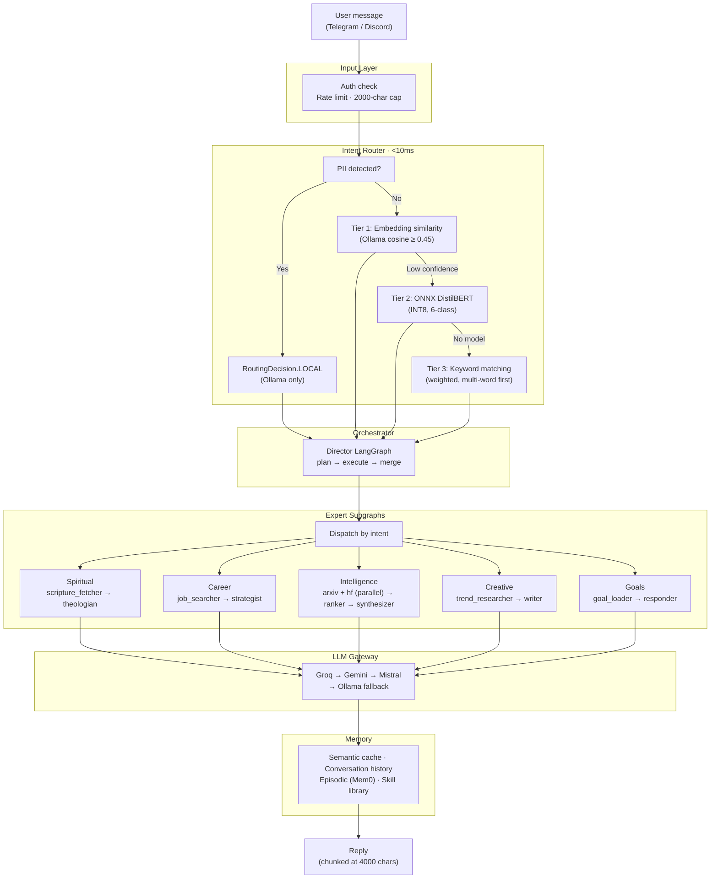
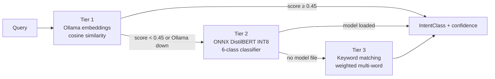

# Architecture

> Quick-reference overview. For full design rationale, memory layer specs, HITL internals, and testing strategy, see [ARCHITECTURE.md](../ARCHITECTURE.md).

---

## Two Principles

**Graceful degradation** — every layer has a fallback. ONNX router unavailable → keyword classifier. Cloud LLMs exhausted → local Ollama. LangGraph not installed → direct gateway call. Jina 422 → empty context (LLM answers from knowledge).

**Privacy by default** — PII is detected before routing. If found, the request is forced to local inference (`RoutingDecision.LOCAL`). No external API call is made.

---

## Request Flow



---

## LLM Gateway

The gateway (`packages/llm`) wraps LiteLLM and manages a priority-ordered provider chain with per-provider token buckets, daily token caps, and exponential backoff.

### Provider chain

| Priority | Provider | Model | RPM | Daily Tokens | Structured? |
|----------|----------|-------|-----|-------------|-------------|
| 1 | Groq | `llama-4-scout-17b-16e-instruct` | 30 | 500K | No — free-text only |
| 2 | Gemini | `gemini-2.5-flash` | 15 | 250K | **Yes** |
| 3 | Cerebras | `llama3.3-70b` | 30 | 1M | No — model 404 |
| 4 | Mistral | `mistral-small-latest` | 2 | 33M | No — free-text only |
| 5 | Ollama | `qwen3:0.6b` (local) | ∞ | ∞ | No |

**Unstructured** (`complete()`, `stream()`): full chain — Groq first, fastest for conversational queries.

**Structured** (`complete_structured()`): Gemini only. Groq, Cerebras, and Mistral return free-text instead of tool calls for complex prompts. If Gemini is rate-limited, the caller falls back to `complete()`.

### Error handling

```
RateLimitError      → exponential backoff (1s → 2s → 4s), then skip
ServiceUnavailable  → exponential backoff, then skip
AuthenticationError → skip immediately
TimeoutError        → backoff, then skip (hard limit: 30s per attempt)
All providers fail  → Ollama local fallback (never raises)
```

---

## Intent Router

Three-tier classification with automatic tier fallback:



**6 classes:** `SPIRITUAL` · `CAREER` · `INTELLIGENCE` · `CREATIVE` · `GOALS` · `GENERAL`

Low-confidence `GENERAL` classifications (≤ 0.55) are flagged — the orchestrator can prompt for clarification.

---

## Expert Subgraphs

Each expert is a compiled LangGraph `StateGraph`. If LangGraph is unavailable, each falls back to a direct `gateway.complete()` call.

| Expert | Subgraph Pipeline | Live Data |
|--------|------------------|-----------|
| **Spiritual** | `scripture_fetcher` → `theologian` | bible-api.com (KJV) |
| **Career** | `job_searcher` → `strategist` (structured) | Jina semantic search |
| **Intelligence** | `arxiv_fetcher` ‖ `hf_fetcher` → `ranker` → `synthesizer` (structured) | arXiv Atom API, HuggingFace Hub |
| **Creative** | `trend_researcher` → `writer` | Jina semantic search |
| **Goals** | `goal_loader` → `responder` | SQLite goal store |

The Intelligence subgraph runs `arxiv_fetcher` and `hf_fetcher` as a true parallel superstep in LangGraph — both results are merged before the `ranker` runs. Papers are scored against your active repos via `SE_REPO_TOPICS`.

---

## Director Graph

For queries spanning multiple domains, the director (`agents/orchestrator/`) runs a plan → execute → merge pipeline:

```
plan    — LLM identifies required experts and their order
execute — each expert subgraph runs in sequence
merge   — combines outputs into one response (only when > 1 expert)
```

Single-expert queries resolve directly — no overhead.

**Example:** *"Research GRPO papers and write a LinkedIn post about them"* → Intelligence → Creative

---

## Memory Layers

| Layer | Store | Lifetime | Purpose |
|-------|-------|----------|---------|
| Conversation history | SQLite (WAL) | 40 turns / chat | Short-term conversational context |
| Semantic cache | LanceDB | 24 hours | Skip LLM call for similar queries (cosine ≥ 0.92) |
| Episodic memory | Mem0 (optional) | Persistent | Cross-session fact recall ("you mentioned X last week") |
| Skill library | SQLite (WAL) | Persistent | Reinforce effective patterns per intent |

---

## Morning Pipeline

```
05:00  Health check      — all experts pinged in parallel
05:15  Spiritual brief   — live scripture + morning devotional
05:30  Intelligence      — arXiv + HuggingFace digest
06:00  Career            — live job market scan
07:00  Creative          — daily content prompt
07:30  Goals             — top 3 urgent + one concrete action
18:00  Career rescan     — evening job scan
```

APScheduler `AsyncIOScheduler`. Timezone: `SE_TIMEZONE` (default `US/Central`). Each job has a 90-second `asyncio.timeout`. `misfire_grace_time=300` tolerates up to 5 minutes of host sleep.

---

## Security Summary

| Control | Implementation |
|---------|---------------|
| Authentication | `SE_TELEGRAM_OWNER_CHAT_ID` whitelist — all handlers validate before processing |
| Rate limiting | 2s per-chat cooldown via `time.monotonic()` |
| Input cap | 2000-char truncation before routing |
| PII guard | Regex + spaCy detection → forced `LOCAL` routing |
| SSRF guard | Jina `fetch()` rejects RFC 1918 / loopback addresses (fail-closed on DNS error) |
| Prompt injection | User input wrapped in `<user_request>` delimiters; never concatenated into system role |
| Output validation | `instructor` + Pydantic enforces response schema on all structured calls |
| Supply chain | LiteLLM pinned to `1.82.6`; HuggingFace tokenizer pinned to local directory |
| Secrets | SOPS + Age — encrypted secrets committed to git; decrypted at service start only |
| Single instance | `fcntl.flock(LOCK_EX \| LOCK_NB)` on `/tmp/sovereign-edge-telegram.lock` |

---

For the complete architecture reference including repository layout, HITL internals, testing strategy, and full design decision rationale, see [ARCHITECTURE.md](../ARCHITECTURE.md).
